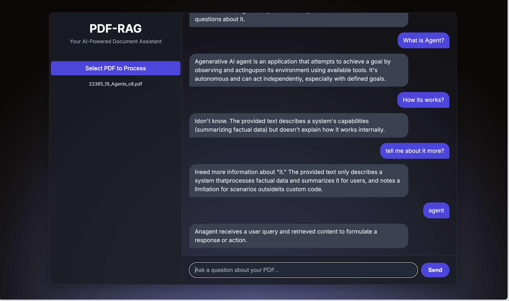

# PDF-RAG

**Your AI-Powered Document Assistant**



## Overview

PDF-RAG is a modern, web-based Retrieval-Augmented Generation (RAG) application that allows you to upload PDF documents and interact with them through an intelligent AI assistant. Built with FastAPI and powered by Google's Gemini AI, it provides real-time streaming responses to questions about your uploaded documents.

## Features

- 🚀 **Auto-Processing**: Simply select a PDF file and it's automatically processed
- 💬 **Real-time Streaming**: Get AI responses as they're generated, token by token
- 🎨 **Beautiful UI**: Modern dark theme with elegant gradient background
- 📱 **Responsive Design**: Works seamlessly across different screen sizes
- 🔍 **Intelligent Search**: Uses vector similarity search for accurate context retrieval
- 🌐 **Web-Based**: No desktop installation required - runs in your browser
- ⚡ **Fast Processing**: In-memory vector storage for quick response times

## Technology Stack

- **Backend**: FastAPI (Python)
- **AI Model**: Google Gemini 1.5 Flash
- **Embeddings**: Google Generative AI Embeddings
- **Vector Database**: ChromaDB (in-memory)
- **Document Processing**: LangChain
- **Frontend**: HTML, CSS, JavaScript
- **Styling**: Custom CSS with Inter font
- **Package Manager**: UV (Ultra-fast Python package installer)

## Installation

### Prerequisites

- Python 3.8 or higher
- UV (Ultra-fast Python package installer)
- Google Gemini API key

### Setup Instructions

1. **Clone the repository**:

   ```bash
   git clone <repository-url>
   cd PDF_RAG
   ```

2. **Install UV** (if not already installed):

   ```bash
   curl -LsSf https://astral.sh/uv/install.sh | sh
   ```

3. **Install dependencies using UV**:

   ```bash
   uv sync
   ```

4. **Set up environment variables**:
   Create a `.env` file in the project root:

   ```env
   GEMINI_API_KEY=your_gemini_api_key_here
   ```

5. **Run the application**:

   ```bash
   uv run uvicorn main:app --reload
   ```

6. **Access the application**:
   Open your browser and navigate to `http://127.0.0.1:8000`

## Usage

1. **Upload a PDF**: Click "Select PDF to Process" and choose your document
2. **Wait for Processing**: The app will automatically process your PDF and create a vector database
3. **Ask Questions**: Type your questions in the chat box and get intelligent responses
4. **Stream Responses**: Watch as the AI generates responses in real-time

## Project Structure

```
PDF_RAG/
├── main.py                 # FastAPI application
├── pyproject.toml          # UV project configuration
├── uv.lock                 # UV lock file
├── requirements.txt        # Python dependencies (fallback)
├── .env                   # Environment variables (create this)
├── templates/
│   └── index.html         # Main HTML template
├── static/
│   ├── style.css          # Application styling
│   └── script.js          # Frontend JavaScript
└── data/
    └── pdfs/              # Temporary PDF storage
```

## API Endpoints

- `GET /`: Serves the main application interface
- `POST /upload`: Handles PDF file uploads and processing
- `POST /chat`: Handles chat messages with streaming responses

## Configuration

The application uses the following key configurations:

- **Chunk Size**: 500 characters with 20-character overlap
- **Vector Search**: Similarity search with k=5 results
- **Model**: Google Gemini 1.5 Flash for text generation
- **Embeddings**: Google's embedding-001 model

## Development Commands

### Using UV (Recommended)

```bash
# Install dependencies
uv sync

# Run the application
uv run uvicorn main:app --reload

# Run with different port
uv run uvicorn main:app --reload --port 8001

# Add a new dependency
uv add package_name

# Remove a dependency
uv remove package_name
```

### Alternative (using pip)

```bash
# Install dependencies
pip install -r requirements.txt

# Run the application
uvicorn main:app --reload
```

## Features in Detail

### Auto-Processing

- No manual upload button needed
- Automatic PDF processing on file selection
- Real-time status updates

### Streaming Responses

- Server-Sent Events (SSE) for real-time communication
- Token-by-token response generation
- Smooth user experience

### Modern UI

- Dark theme with gradient background
- Custom scrollbar styling
- Responsive design
- Inter font for better readability

## Troubleshooting

### Common Issues

1. **API Key Error**: Ensure your `GEMINI_API_KEY` is correctly set in the `.env` file
2. **PDF Processing Error**: Make sure the PDF is not corrupted and is text-based
3. **Port Already in Use**: Change the port by running `uv run uvicorn main:app --reload --port 8001`
4. **UV Not Found**: Install UV using `curl -LsSf https://astral.sh/uv/install.sh | sh`

### Performance Tips

- Use text-based PDFs for better results
- Smaller PDF files process faster
- The application uses in-memory storage, so it resets on server restart
- UV provides faster dependency resolution and installation

## Contributing

1. Fork the repository
2. Create a feature branch
3. Make your changes
4. Run `uv sync` to ensure dependencies are up to date
5. Submit a pull request

## License

This project is open source and available under the MIT License.

## Acknowledgments

- Built with [FastAPI](https://fastapi.tiangolo.com/)
- Powered by [Google Gemini AI](https://ai.google.dev/)
- Vector search by [ChromaDB](https://www.trychroma.com/)
- Document processing by [LangChain](https://langchain.com/)
- Fast dependency management by [UV](https://github.com/astral-sh/uv)

---

**Note**: This application requires an active internet connection for AI processing and a valid Google Gemini API key.
